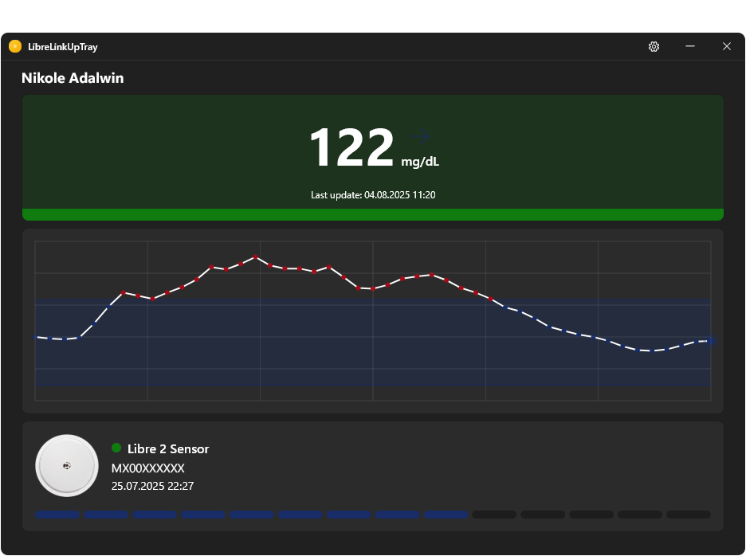

# 🩸 • Libre-Link-Up-Tray

Windows system tray app to check glucose with Libre Link Up API.

> [!WARNING]
> The program has not yet been published.
>
> 

## ⭐ • Sources

- [LibreLinkUp HTTP-Dump](https://gist.github.com/khskekec/6c13ba01b10d3018d816706a32ae8ab2)

## 🧬 • Features

* [X] Displays the name and surname of the person whose data is displayed.
* [X] Displays the glucose level in the app and system tray.
* [X] Shows a moving arrow for the glucose level.
* [X] Shows the date and time of the last update.
* [X] Displays a graph of your glucose history with target limits.
* [X] Allows you to hover to view your glucose level at a specified time.
* [X] Displays the status, model, and serial number of the sensor.
* [X] Displays the date and time the sensor was activated and the number of days the sensor has been used out of a 14-day period.
* [X] Sends a push notification when the glucose level goes beyond the target range and returns.

## 🧩 • Usage

> [!CAUTION]
> Never use the app as the only source of information about your glucose level, glucose movement, or sensor expiration date. It is only intended to assist in monitoring, in case of critical situations with glucose levels or sensor status, always check the information in the official FreeStyle LibreLink and LibreLinkUp apps and rely on them only! The author wants to help people make their lives more comfortable, but he doesn't want his mistakes to be responsible for people's deaths.

> After launching the application, you need to log in to your LibreLinkUp account, after which the application will be hidden and available in the system tray. To open the application for detailed information, just click on the tray icon.

## 📊 • Development Stats

